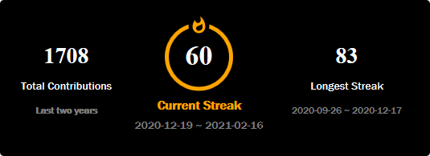
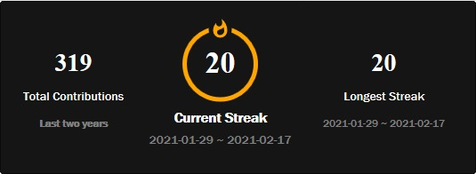

# Github-Streak

A node based API that generates your Github contribution streak. It also shows the highest contribution streak in last two years.

- Inspired from [DenverCoder1/github-readme-streak-stats](https://github.com/DenverCoder1/github-readme-streak-stats)

#

## Demo



#

## Live API

To quickly add this to your readme just add this code

```

```

- theme parameter is optional and can be ignored. By default you will get the `dark` theme.
  
- For all theme support check [this.](./docs/themes/README.md). List of themes is as per below
  - dark(default)
  - light
  - highcontrast(recomended)
  - radical
  - buefy
- Although I will still suggest custom hosting as this is hosted with free heroku service and can stop working specially after 23 days of the month.(why 23? Ask me somewhere...)

#

## Usage

- Clone this repo.
- Run

```
npm install
```

- Then run

```
npm start
```

- For hosting:

  Any Type of node server running hosting service can host this.

#

## Limitations

- This only counts stats from last 2 years. If your streak is greater than 2 years, "STOP IT. GET SOME HELP."
- This stats are scraped from github page directly so if they change something, this can break. In this case contact me.

#

## Creator

- [PhoenixCreation](https://github.com/PhoenixCreation)
- Inspired and somewhat copied from [DanverCoder1](https://github.com/DenverCoder1)

#

## Contribution

- Always welcome
- Don't waste time in issue... create a pull request directly if you can fix it.

#

## TODO

- [x] add custom theme support
- [ ] add PR/ISSUE counter
- [ ] Make it for whole lifetime rather then 2 years

#

### Give a 🌟 if you liked it....

#
