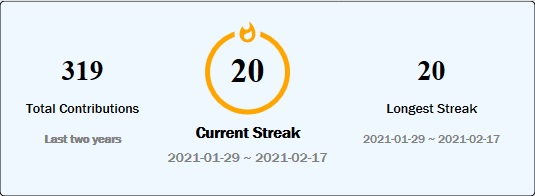
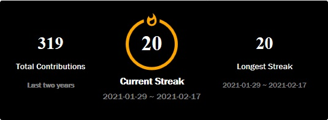
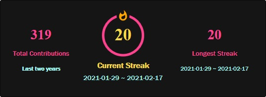
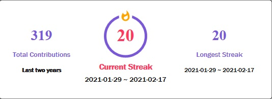

## Theme support

- You can choose theme based on your choice.

```

```

Don't worry if you don't specify theme it will automatically switch to "dark" theme.

## Currently available themes are as per below:

- [dark](#dark)
- [light](#light)
- [highcontrast(recomended)](#highcontrast)
- [radical](#radical)
- [buefy](#buefy)

## dark


## light



## highcontrast



## radical



## buefy



#

I know this are very less examples so if you want to your theme to be here then go to `index.js` and find `const themes = {}` and add your theme there and create a Pull Request.

If you don't know how to do it create issue with your desired colors and I'll make it.

Althogh I am working on customizable theme so wait for it(don't know how much).
